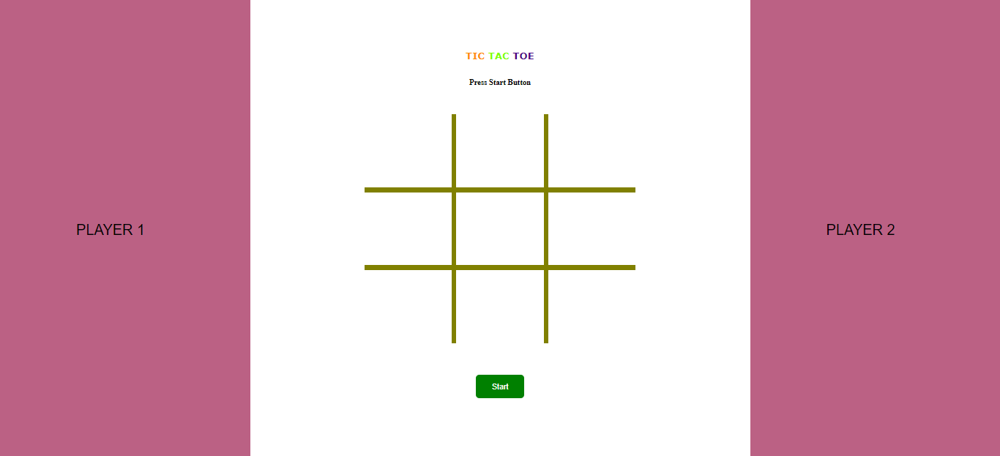
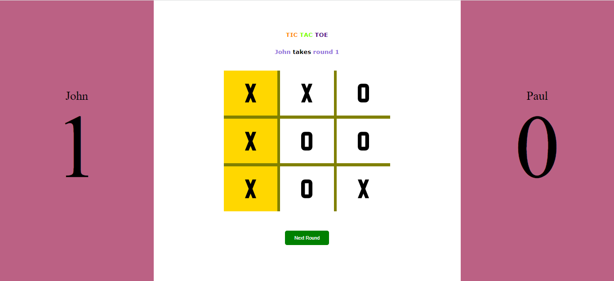
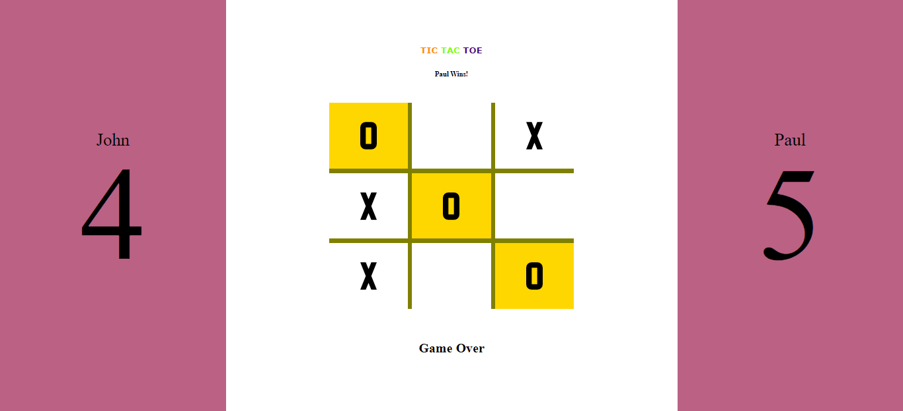

# TicTacToe

## Description
  This is a "The Odin Project" Javascript curriculum project. A virtual tic-tac-toe game

## Usage
  #### Start the game with changeable player names.
  
  #### Players win a round by placing three of their designated marks( X and O ) in a horizontal, vertical or diagonal row.
  
  #### Whoever scores 5 or get the higher score within 10 rounds win the game
  

## Js lessons covered
  - modular functions
  - factory functions

## Extra learnings
  - pub_sub design
  - concatinating files

## Reflection
  Many things i have learned and realized about Javascript on this project. Less did a knew that the language can this be oriented and readable. It got me more interested and excited for more Javascript lessons.

## Project link
  https://www.theodinproject.com/lessons/javascript-tic-tac-toe